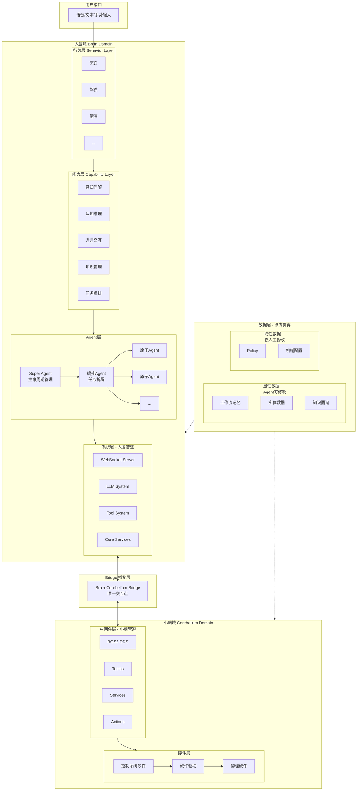

# OpenRoboBrain (ORB) - 具身智能机器人大脑系统

开源项目 | 版本: 0.2.0 | Python 包名: `orb`

## 项目状态

**当前阶段**: 核心功能已贯通，MuJoCo G1 仿真演示开发中

- 七层架构 + 双管道通信完整实现
- LLM 双模式管线 (Ollama 本地 / 云端 API)
- 类人记忆系统 (MemoryRanker: 5信号排序 + 遗忘曲线 + 扩散激活)
- Session Compaction (自动压缩 + LLM 摘要)
- MuJoCo G1 仿真三终端演示 (feature/mujoco-g1-sim 分支)
- 219 个测试全部通过

**总体完成度**: ~60%

---

## 架构概览

### 核心设计：大脑-小脑完全解耦

OpenRoboBrain 采用**大小脑双管道架构**，两者完全解耦，通过 Bridge（桥接器）作为唯一交互点进行状态同步。

| 维度 | 大脑 (Brain) | 小脑 (Cerebellum) |
|------|-------------|------------------|
| **通信协议** | WebSocket JSON | ROS2 DDS |
| **时间尺度** | 秒级（认知决策） | 毫秒级（运动控制） |
| **工具系统** | 认知工具（搜索/文件/HTTP/LLM） | 硬件驱动（传感器/执行器） |
| **记忆系统** | 显性数据（可Agent修改） | 隐性数据（仅人工修改） |
| **沙箱机制** | 权限控制/Docker | 硬件安全策略 |

### 七层架构



#### 层级说明

| 层级 | 职责 | 状态 |
|------|------|------|
| **行为层** | 复合行为（烹饪/驾驶），关联工作流记忆，避免重复推理 | ⏳ 待实现 |
| **能力层** | 原子认知能力（感知/推理/交互），不含运动控制 | ⏳ 骨架 |
| **Agent层** | 三级结构：Super → 编排 → 原子Agent | ✅ 基础完成 |
| **系统层** | 大脑管道（WebSocket JSON），LLM/工具/核心服务 | ✅ 基础完成 |
| **Bridge** | 大小脑唯一交互点，命令翻译与状态同步 | ✅ 基础完成 |
| **中间件层** | 小脑管道（ROS2 DDS），话题/服务/Action | ⏳ 仅接口 |
| **硬件层** | 控制软件 → 驱动 → 物理硬件 | ⏳ 仅接口 |
| **数据层** | 纵向贯穿，显性（可学习）+ 隐性（受保护） | 🔨 内存实现 |

---

## 目录结构

```
orb/
├── core.py                 # 系统入口 ✅
├── agent/                  # Agent层
│   ├── base.py             # Agent基类(含LLM/工具集成) ✅
│   ├── smart_agent.py      # 智能Agent(ReAct模式) ✅
│   ├── super/              # Super Agent ✅
│   ├── orchestrator/       # 编排Agent ✅
│   ├── atomic/             # 原子Agent 🔨
│   ├── runtime/            # Agent运行时 🔨
│   ├── subagent/           # 子Agent管理 🔨
│   └── security/           # 安全权限 🔨
├── system/
│   ├── brain_pipeline/     # 大脑管道 ✅
│   ├── llm/                # LLM系统 ✅
│   │   └── providers/      # OpenAI/Claude/Ollama ✅
│   ├── tools/              # 工具系统 🔨
│   │   ├── builtin/        # 内置工具 🔨
│   │   └── mcp/            # MCP集成 🔨
│   └── services/           # 核心服务 ✅
├── middleware/
│   └── cerebellum_pipeline/ # ROS2集成 ⏳
├── hardware/               # 硬件抽象 ⏳
├── data/
│   ├── gateway/            # 数据网关 ✅
│   ├── explicit/           # 显性数据 🔨
│   └── implicit/           # 隐性数据 🔨
├── skills/                 # 技能系统 🔨
└── capability/             # 能力层 ⏳
```

---

## 核心模块实现状态

### 已实现功能

| 模块 | 功能 | 状态 |
|------|------|------|
| LLM系统 | OpenAI/Anthropic/Ollama Provider | ✅ 完整 |
| LLM系统 | 流式输出、工具调用转换 | ✅ 完整 |
| Agent基类 | LLM集成、消息处理、状态管理 | ✅ 完整 |
| 消息总线 | Agent间异步通信、发布订阅 | ✅ 完整 |
| 配置中心 | YAML配置加载、热更新 | ✅ 完整 |
| 日志系统 | 分级日志、统一格式 | ✅ 完整 |

### 部分实现（可用但不完整）

| 模块 | 已实现 | 缺失 |
|------|--------|------|
| 工具系统 | 文件操作工具 | HTTP工具部分功能、Shell工具安全检查 |
| Agent运行时 | 基础循环 | 错误恢复、超时处理 |
| 数据层 | 内存存储 | 持久化(SQLite/Redis)、向量检索 |
| 监控系统 | 指标收集框架 | 实际指标采集、告警 |

### 仅接口定义（需要实现）

| 模块 | 说明 |
|------|------|
| 硬件抽象层 | 传感器/执行器接口已定义，无实现 |
| ROS2集成 | 节点封装已定义，实际通信未实现 |
| 视觉Agent | 接口已定义，模型调用未实现 |
| 技能系统 | 框架已定义，具体技能逻辑未实现 |

---

## 快速开始

```bash
# 安装
pip install -e .

# 运行（当前仅能启动框架）
python -c "
import asyncio
from orb import OpenRoboBrain

async def main():
    brain = OpenRoboBrain()
    await brain.initialize()
    await brain.start()
    # 系统启动但无实际功能
    await asyncio.sleep(5)
    await brain.stop()

asyncio.run(main())
"
```

---

## 配置

主要配置文件: `configs/`
- `system.yaml` - 系统配置
- `agents.yaml` - Agent配置  
- `pipeline.yaml` - 管道配置
- `data.yaml` - 数据层配置

LLM配置示例（需要在环境变量或配置文件中设置）:
```yaml
llm:
  provider: "openai"  # openai, anthropic, ollama
  model: "gpt-4"
  api_key: "${OPENAI_API_KEY}"
```

---

## 开发说明

### 代码规范
- Python 3.10+
- 异步优先 (asyncio)
- 类型注解必须
- 文档字符串必须

### 测试
```bash
# 当前无测试覆盖
pytest tests/  # TODO
```

### 关键设计决策

| 决策 | 说明 |
|------|------|
| **大小脑解耦** | 大脑(WebSocket JSON)和小脑(ROS2 DDS)完全解耦，各自独立演进 |
| **唯一桥接点** | Bridge是大小脑之间的唯一交互点，负责命令转换和状态同步 |
| **双管道分层** | 大脑管道@系统层（非实时），小脑管道@中间件层（实时） |
| **三级Agent** | Super(管理) → 编排(调度) → 原子(执行) |
| **显隐分离** | 显性数据可Agent修改，隐性数据(Policy)仅人工修改 |
| **工具隔离** | 大脑用认知工具，小脑用硬件驱动，互不影响 |
| **沙箱独立** | 大脑用权限控制/Docker，小脑用硬件安全策略 |
| **LLM抽象** | 统一接口，支持多Provider切换 |

---

## MuJoCo G1 仿真演示 (feature/mujoco-g1-sim 分支)

三终端联动演示: 自然语言 -> LLM 推理 -> 机器人仿真执行

```
终端1 (CLI):       > 去厨房
                    OpenRoboBrain: 好的，我来帮你导航到厨房。

终端2 (ROS2):      [15:30:02] /brain/cmd_vel
                      command_type: navigate
                      parameters: {target: kitchen}

终端3 (MuJoCo):    [G1 机器人开始行走步态, cmd=[0.5, 0, 0]]
```

### 快速开始 (仿真)

```bash
# 1. 安装 Ollama + 模型
# https://ollama.com/download
ollama pull qwen2.5:3b

# 2. 安装仿真依赖
pip install -r requirements-sim.txt
git clone https://github.com/unitreerobotics/unitree_rl_gym.git

# 3. 一键启动三终端
python scripts/start_sim.py
```

### 技术栈

- **LLM**: Ollama + Qwen2.5 (本地, 支持 Tool Calling)
- **策略**: unitree_rl_gym 预训练行走策略 (PPO, 29-DOF)
- **仿真**: MuJoCo + 宇树 G1 人形机器人
- **通信**: WebSocket 命令广播

---

## 详细文档

- [系统架构详解](docs/ARCHITECTURE.md)
- [开发路线图](docs/ROADMAP.md)
- [待办任务](docs/TODO.md)
- [风险管理](docs/RISKS.md)
